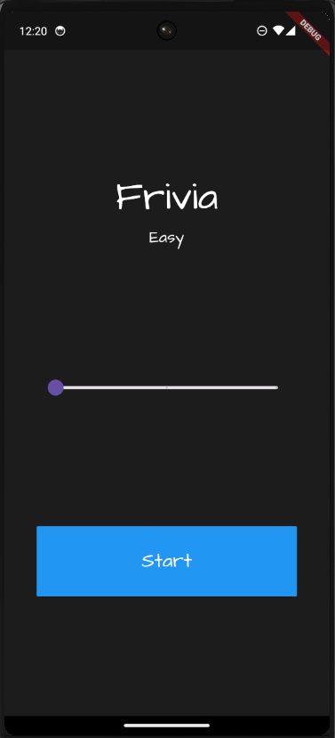
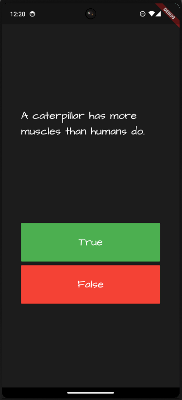
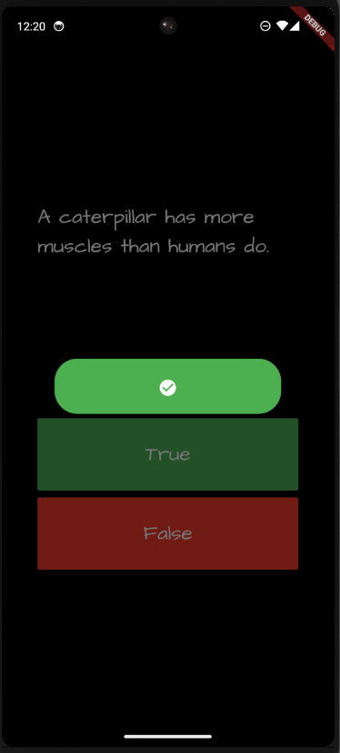
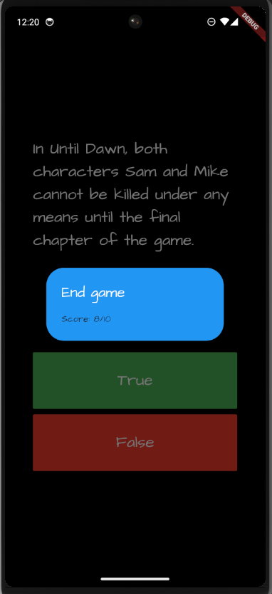

# Frivia

- Frivia is an engaging trivia app developed with Flutter.
- It extracts 10 random questions from the Open Trivia Database (OpenTDB) API based on the selected difficulty level on the home page.
- The app allows users to select answers and provides immediate feedback on whether the chosen answer is correct.
- At the end of the quiz, it displays the final score.

## Working Video
- Click here!
- [Frivia Demo](https://youtube.com/shorts/ywgqIoiKcm4?feature=share)

## Product Image
,
,
,

